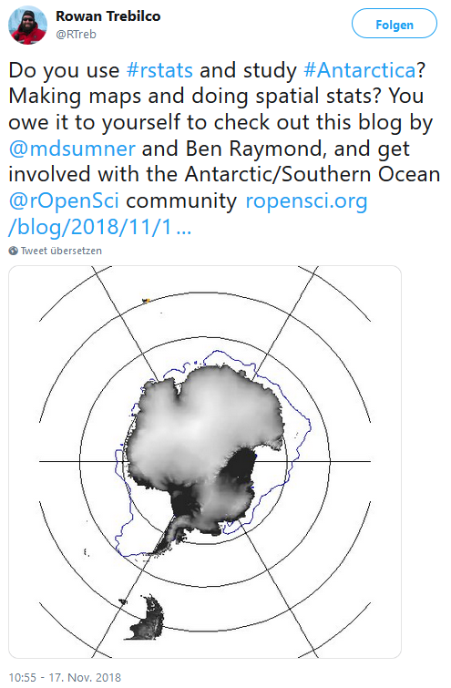

class: middle center

## About me

Research Associate 

Official Statistics & Open Government Data 

Canton of Zurich

#### [open.zh.ch](open.zh.ch/)

#### [statistik.zh.ch](statistik.zh.ch/)

`r icon::fa("twitter")`[@thlorusso](https://twitter.com/thlorusso)

???
Dank den ID für Einladung.

Ich bin wissenschaftlicher MA im stat. Amt ZH - ich arbeite tagtäglich mit R, denn wir produzieren ein Grossteil unserer Statistiken, der Visualisierungen die wir veröffentlichen bis hin zu ganzen Publikationen mit R. 

Seit Anfang 2018 bin ich quasi zweigeteilt und darf als Teil der Fach- und Koordinationsstelle Open Government Data am Ausbau des Angebots offener Behördendaten mitarbeiten. 

In dieser Veranstaltungsreihe geht es um offene Daten für Öffentlichkeit und Forschung. In meinem Referat wird es jedoch nicht nur um offene Daten gehen, sondern darum welchen Mehrwert das Arbeiten mit offenen Daten UND offener Software wie etwa R gleichzeitig bieten. 

---
# The challenges of data aquisition

- getting data is a critical step in most research 

- sometimes one of the most difficult and time-consuming steps 

- even when data is accessible not granted that it is easy to find 

- frustrating format variabilities & compatibility issues 

Not only hindering academic research, but also the development of innovative data-driven products & services.

???

Welche Herausforderungen haben Forschende, Datenjournalisten oder auch Privatpersonen eine Frage haben, die sie anhand von strukturierer, hochqualitativer Informationen beantwortet haben möchten? 

Sie müssen sich diese Informationen beschaffen. 

Aber... es ist nicht immer ganz einfach. Sie können sich glücklich schätzen, wenn Sie in einem Projekt arbeiten in dem man Ihnen die Daten schon fix - fertig aufbereitet zur Verfügung stellen kann. Doch ist dies wahrscheinlich nicht die Regel. Wir kriegen beim Statistischen Amt tagtäglich Anfragen zu den unterschiedlichsten Themen und wissen um die Schwierigkeiten bei der Datenbeschaffung.

---

# Open Data to the rescue

__Open Data can contribute to making data aquisition much less painful__

- machine readable, freely accessible & published in open formats with open license  

- searchable on open data portals (e.g. [opendata.swiss](https://opendata.swiss/de/) / [data.europa.eu](http://data.europa.eu/) / [opentransportdata.swiss](https://opentransportdata.swiss/en/) / [opendata.cern.ch](http://opendata.cern.ch/))

--

Also, there are many ongoing efforts to make it easier to retrieve data directly from (open) repositories with the same tools that are used for analysis. Initatives such as __rOpenSci__ contribute heavily to this ("open tools for open science").

In the case of __R__ → growing number of (open) data-packages and API-wrappers.


https://ropensci.org/


???

Offene Daten können Abhilfe schaffen. Den offene Daten erfüllen idR eine Reihe von Kriterien, die einem das Leben erleichtern. Sie kommen in maschinenlesbarer Form daher - nicht in Form unstrukturierter pdf Dateien aus denen sie beispielsweise Tabellen mühsam herauskopieren müssen. Sie kommen in offenen Formaten daher, als zum Beispiel einer csv oder json Datei - sie benötigen also keine spezifische, propietäre SW um diese zu verarbeiten. Und sie stehen unter einer offenen Lizenz, die Klarheit schafft was die Nutzung der Daten angeht und es ihnen erlaubt die Daten für ihre Zwecke zu nutzen. Dies ist kein zu vernachlässigender Aspekt: es gibt Daten die frei verfügbar sind im Netz, die sie sich beschaffen können, obwohl sie ggf. gegen Nutzungsbedingungen verstossen, wenn sie diese für Forschungszwecke benutzen.

Offene Daten - insbesondere die die durch den Staat oder durch grössere Unternehmen oder Forschungsinistitutionen pubiliziert werden sind zudem auf Portalen wie opendata.swiss suchbar, die den selben standard anwenden (DCAT) und so eine Art Ökosystem darstellen.

Es gibt Bemühungen , Daten direkt in die Tools bringen, welche Forschende und Entwickler nutzen. Einmal suchen , dann mit demselben Code wiederkehrend dasselbe tun. Das bedeuted, eine Analyse zu einem späteren Zeitpunkt mit aktualisierten Daten ganz einfach repetieren zu können.


---
# What is `r icon::fa("r-project")`?

- programming language  
- open source  
- runs on multiple platforms  


The R package - ecosystem comprehends a myriad of packages that extend the functionality of the R language. They range from data-manipulation, data-collection and visualization to modelling, GIS as well as many domain specific applications.


__Field Guide to the R Ecosystem__  

https://fg2re.sellorm.com/whatisr.html


???

R ist eine open source programmiersprache. Man kann sie interaktiv ausführen, oder auch skripte ablegen die dann ein interpreter ausführt - ähnlich wie bei ruby oder python. 

R hebt sich von diesen sprachen jedoch punkto haupt-einsatzgebiet ab. Obwohl R immer breiter wird in der anwendung, war es ursprünglich ein open-source nachfolger der statistik-sprache S. Somit ist R in erster linie eine programmiersprache für statistischen gebrauch - und dementsprechend weitverbreitet an den universitäten in - statistik-programmen oder data-science lehrgängen weltweit. Für die öffentliche Statistik ist R prädestiniert - ich war diesen Herbst an einer Konferenz zur Nutzung von R in der öff. Statistik : R ist das TOol der wahl.
---
class: inverse, center, middle


???
R - ursprünglich statsitik-prgrammiersprache für datenanylse und modellierung ist mittlerweile ein echt vielfältiges werkzeug - ähnlich einem Sackmesser.Daten manipulation, modellierung von der Regression zu statistischem lernen, aber auch Daten erheen im netz (web scraping / crawling). Und in gewissen Dingen ist R ziemlich exzellent - zum beisipel wenn es darum geht, die eigenen Resultate direkt aus R heraus in ein publikationsreifes Gefäss einzubetten.

Was ist damit gemeint? 

---
With R you can create fully reproducible documents in various formats, books, presentations, blogposts or even build web-applications that let others explore data interactively.

<center></center>

???
Mit R können Sie reproduzierbare Dokumente in unterschiedlichster Form generieren. Ganze Bücher oder Dissertationen, sie könnemit R eine Webseite generieren und im Stile eines Datenblogs laufends aus R heraus neue Posts publizieren, sie können Web-Applikationen bauen die andere ihre Daten und Resultate interaktiv durchforsten lassen. Sie sehen - die Möglichkeiten sind schier unbegrenzt - und das mit frei verfügbarer Software.


---

# Democratization of data & tools for analysis

- __R__ (and similar open source software) lowers the barriers and costs to make data analysis __repeatable and reproducible__.

- __Open Data__ ensures that everyone can access the same information for free (ideally, in a well structured manner)

--

However, it is not always possible to use open data (sensitive data, privacy & security reasons) and open source software (special formats).

But whenever it is possible, their combination allows for __reproducibilty__, __repeatability__ as well as __collaboration on unprecedentend scale__

???
Rekapitulieren wir hier kurz : R (und ähnliche oss) senken kosten und barrieren um datenanalyse repetier- und reproduzierbar zu machen. 

Offene Daten ermöglichen, dass alle freien zugriff auf dieselben, gut strukturierten, informationen haben. 

Dies kommt einer demokratisierung von information in form von daten und der werkzeuge für die analyse gleich. 

Natürlich : nicht immer möglich offene Daten zu nutzen - Einzeldaten, Gesundheitsdaten : Daten die aus datenschutz- oder sicherheitsgründen nicht offen sein können. Auch bei den Formaten, wen man es mit speziellen Datenstrukturen zu tun hat, die mit proprietärer Software ausgwertet werden müssen.

Aber wenn es möglich ist : erlaubt ihnen diese Kombination nie da gewesene r & r und auch zusammenarbeit über organisationsgrenzen hinweg, ohne sich dabei darum kümmern zu müssen wer zugriffsberechtigt ist oder wer eine lizenz von software x hat.

---
class: centre, middle

<center><a href="https://twitter.com/RTreb/status/1063717277001023490"></a></center>

???
Beispiel : Arktisforscher die sich zusammenschliessen, Know How austauschen , packages für R erstellen die Daten zum Zustand der Arktis direkt in R bringen - aus den unterschiedlichsten Quellen: Eis, Ozeanographie, Atomsphärische Daten. Daten kommen aus unterschiedlichsten Quellen : EU kopernikus, NASA etc. Über Institutsgrenzen hinweg. 

---
class: inverse, center, middle

# R & Open Government Data 

### Showcase : Real Time Data-Service of Vote Results in the Canton Zurich

???

Nun haben sie viel grundsätzliches gehört. Über zu einem Beispiel mit offenen Daten des Kantons Zürich. Als Politologie-Absolvent habe ich eines gewählt dass mir besonders am Herzen liegt. Das stat amt ist auch die kantonale Wahl- und Abstimmungszentrale. Die Resultate aus den Gemeinden fliessen am Abstimmungssontag bei uns zusammen, wir plausibilisieren diese und publizieren die Resultate laufend. Über unseren Echtzeitdaten-Service kann dieser Datenstrom direkt angezapft und der Auszählstand in Echzeit abgerufen werden. Sehr nützlich um in eine Applikation mit Live-Ticker charakter einzubetten.


---
The Canton of Zurich provides a web service for real time results on voting sundays.
https://opendata.swiss/de/dataset/echtzeitdaten-am-abstimmungstag

```{r,message=FALSE,warning=FALSE}
library(sf)
library(tidyverse)

# get json via webservice, dataset-description : https://opendata.swiss/de/dataset/echtzeitdaten-am-abstimmungstag
data <- jsonlite::fromJSON("http://www.wahlen.zh.ch/abstimmungen/2016_09_25/viewer_download.php")

# transform nested list into an R-friendly dataframe
data <- data %>% 
  map_dfr(bind_rows) %>% 
  unnest(VORLAGEN)

```

???
Der Service ist auf opendata.swiss beschrieben. Für jeden Abstimmungstermin gibt es ein neues Datum / neuen Link. Ich kann das json via R abfragen und es dann in eine R-freundliche Datenstruktur bringen.

---
Some data preparation...
```{r,message=FALSE,warning=FALSE, message=FALSE, dpi=100, fig.height=2}
#short labels for each vote topic
data$VORLAGE_NAME <- factor(data$VORLAGE_NAME, labels = c("Grüne Wirtschaft", "AHV Plus", "NDG", "Bezahlbare Kinderbetreuung"))

data <-data %>% mutate_at(vars(JA_STIMMEN_ABSOLUT,NEIN_STIMMEN_ABSOLUT,JA_PROZENT,STIMMBETEILIGUNG),as.numeric)

#aggregate results on municipality level
data <-data %>% 
  group_by(BFS,VORLAGE_NAME) %>% 
  summarize(ja_anteil=round(sum(JA_STIMMEN_ABSOLUT,na.rm=T)/sum(JA_STIMMEN_ABSOLUT+NEIN_STIMMEN_ABSOLUT,na.rm=T)*100,1))
```

???
Um mit analyse & visualisierung loslegen zu können versehe ich die Abstimmungen noch mit Kurzbezeichnungen und rechne die Resultate auf die Gemeindeebene hoch. Der Webservice liefert diese auf Wahlkreisebene. 

---

Let's take a glimpse at the distribution of yes-shares across municipalities and voting topics.
.pull-left[
```{r, dpi=120, warning=FALSE, message=FALSE}
plot<-ggplot(data, aes(x=ja_anteil)) + 
              geom_histogram(fill="steelblue")+
              facet_wrap(~VORLAGE_NAME)+
              scale_x_continuous(limits = c(0, 100),breaks=seq(0,100,25))
```
]
--

.pull-right[

```{r, warnings=FALSE, dpi=90,message=FALSE,echo=FALSE}
plot
```

]

???
Nun können wir einen ersten Blick auf die Verteilung der Ja-Anteile nach Vorlage werfen.

---

.pull-left[

By adding geodata (municipality borders), we can visualize the results on a map.

```{r,message=FALSE,warning=FALSE}
# get municipality-borders shapefile
downloader::download("http://www.web.statistik.zh.ch/cms_basiskarten/gen_Gemeinde_2017/GEN_A4_GEMEINDEN_SEEN_2017_F.zip", dest="dataset.zip", mode="wb")

unzip("dataset.zip")

gemeinden <- sf::read_sf("GEN_A4_GEMEINDEN_SEEN_2017_F" ,stringsAsFactors = FALSE) %>% select(BFS,BEZIRK)

#join geodata to the vote result dataframe
mapdata <- inner_join(gemeinden,data, by=c("BFS")) 

#map displaying yes-shares per municpality
map <- ggplot(mapdata)+
  geom_sf(aes(fill=ja_anteil),colour="white")+
  facet_wrap(~VORLAGE_NAME)
```
]

--

.pull-right[

```{r, dpi=120}
map
```

]

??? 
In dem wir uns noch Geodaten mit den Gemeindegrenzen dazuholen können wir die ja-anteile auch auf einer Karte anzeigen.

---

.pull-left[

```{r,message=FALSE,warning=FALSE, dpi=125}

mapnew <- map+
              coord_sf(datum = NA)+ #<<
              labs(fill="Ja (in %)")+#<<
              theme_void()+ #<<
              scale_fill_gradient2(midpoint=50)+ #<<
              guides(fill = guide_colourbar(barwidth = 0.5, barheight = 10)) #<<

```
]

--

.pull-right[

```{r,echo=FALSE, dpi=120}
mapnew
```

]

---

```{r}

glimpse(mapdata)

```

Thanks to the [sf-package](https://r-spatial.github.io/sf/) we can store the actual data as well as the needed geo-information in the same tabular dataframe.

---
Let's add some data to try to explain the results of a specific vote.
```{r}
# https://opendata.swiss/de/dataset/bevolkerung-pers -> population
bev <- read.csv("http://www.web.statistik.zh.ch/ogd/data/KANTON_ZUERICH_133.csv", sep=";", encoding="UTF8") %>%
  select(BFS = `ï..BFS_NR`, einwohner=INDIKATOR_VALUE,INDIKATOR_JAHR,GEBIET_NAME) %>% 
  dplyr::filter(INDIKATOR_JAHR==2017 & BFS != 0)

# https://opendata.swiss/de/dataset/nrw-wahleranteil-sp -> social democrats vote share
sp <- read.csv("http://www.web.statistik.zh.ch/ogd/data/KANTON_ZUERICH_124.csv", sep=";", encoding="UTF8") %>%
  select(BFS = `ï..BFS_NR`, sp_anteil=INDIKATOR_VALUE,INDIKATOR_JAHR) %>% 
  dplyr::filter(INDIKATOR_JAHR==2015 & BFS != 0)

# join to vote-results
plotdata <- mapdata %>% 
            filter(VORLAGE_NAME=="Bezahlbare Kinderbetreuung") %>% 
            left_join(sp, by=c("BFS")) %>% 
            left_join(bev, by=c("BFS")) %>% 
            mutate_at(vars(sp_anteil,einwohner),as.numeric) 
```

???
Wen wir nun eine Erklärung für die unterschiedlich hohe Zustimmung zu einer Vorlage suchen möchten, können wir uns noch weitere Daten von opendata.swiss holen. Hier laden wir Einwohnerzahlen und SP-Wähleranteile herunter. Ich fügen diese mit den Abstimmungsdaten zusammen.


---

.pull-left[
```{r,warnings=FALSE,message=FALSE}
# devtools::install_github("statistikZH/statR")
library(statR)

plot <- ggplot(plotdata, aes(sp_anteil,ja_anteil, size=einwohner/1000))+
            geom_point(colour="steelblue",alpha=0.8)+
            theme_stat()+
            guides(fill="FALSE")+
            labs(title="Bezahlbare Kinderbetreuung",
                 subtitle="Zustimmung zur VI bezahlbare Kinderbetreuung vs SP-Wähleranteil (NRW 2015)",
                 size="Einwohner (in '000)", x="SP-Wähleranteil (%)",y="Ja-Anteil (%)")

```
]

--

.pull-right[
```{r,warnings=FALSE, dpi=120,message=FALSE}
plot
```
]

???
Ich setze nun die Zustimmung zur Initiative für bezahlbare Kinderbetreuung ins Verhältnis mit dem SP-Wähleranteil : Sie sehen, es scheint da einen Zusammenhang zu geben. Nun könnte ich hier die These aufstellen, dass SP-Wähler der Vorlage eher zugestimmt haben. Was nicht unplausibel ist, es handelt sich hier um ein eher linkes Anliegen. Doch Sie können mich auch kritisieren und sagen, dass hier andere Faktoren entscheidend waren und man das noch mit Individualdaten prüfen müsste (Vor- oder Nachumfragedaten). Die Schlüsse die ich aus der Analyse ziehe, die können sie berechtigterweise hinterfragen. Da aber alles transparent ist - woher die Daten kommen und wie ich diese zusammengestellt und visualisiert habe - ist für sie jederzeit ersichtlich, auf welcher Basis ich zu diesem Schluss gekommen bin und können prüfen, ob das was ich als 'empirische' Grundlage hinzuziehe sauber ist oder ob es fehler gibt.

---
class: inverse, middle, center


## Every step, from data-retrieval to the final visualizations, is repeatable AND reproducible

--

`r icon::fa("arrow-down")`
# TRUST


???
Was bringt es, dass sie diese Präsentation und die Grafiken darin selbst erstellen können, in dem Sie einfach den Code selbst ausführen? Das sie nichts händisch herunterladen und die Daten noch selber in eine Form bringen, welche es ihnen erlaubt diese auf Fehler zu prüfen?

Es erhöht das Vertrauen. Sie können verfolgen, was meine Quellen sind und auf welchem Weg ich zum Ziel gekommen bin. An allfällign Schlüssen, die ich daraus ziehe, an denen könnten sie zweifeln. 

---

## How does this work?

- With [RMarkdown](https://rmarkdown.rstudio.com/), narrative text and code are part of the same document. We can weave elegantly formated output, such as this very presentation, from it.

- By recurring to freely available (open) data sources the data is integrated just by linking to it (stable URL / API).

---
class: inverse, middle,center

# Interactive Graphics & 
# Web Applications with R

???
Nun mit R ist mehr möglich, als das erstellen von statischen Abbildungen : sie können ihre Arbeit , ihre Resultate ihrem Publikum auch in interaktiver Form zugänglich machen.

---
With just one line of code, we can visualize the yes-shares on an interactive map.

```{r,eval=FALSE}
library(mapview)

mapview(plotdata,zcol="ja_anteil")
```

<center>
```{r,echo=FALSE}
library(mapview)

mapview(plotdata,zcol="ja_anteil")

```
</center>

???
Zum Beispiel können wir ganz einfach eine interaktive Karte erstellen - mit einer Linie code. Oder aber ist es möglich, den zuvor verwendeten code in eine Web applikation einzubauen. 

---
# Building a Web-App with R


Shiny-Apps let others interact with your data and your analysis. We can use Shiny to build an R powered Web-Application on top of the real time vote result data stream.

https://statistikzh.shinyapps.io/zhvote/

--
- The app is automatically updated, as soon as a new vote date is listed, via the opendata.swiss [CKAN Action API](https://handbook.opendata.swiss/support/api.html)
--

- No need to update by hand __before__ votation sundays
--

- Real time data stream __on__ votation sundays
--

- No web development skills required
--

code: https://github.com/openZH/zhvote_app


???
Wir können eine Shiny - App bauen, die via openda

Shiny Apps let other people run your R-Code interactively without having to code themselfes.


Hier sind die Grenzen natürlich durch sie vorgegeben : die User haben Auswahlmöglichkeiten die durch sie vordefiniert sind.

Some basic html / css skills nice to have : customizing! The nice thing with R is that if you know R , it lets you do things as this (building web apps)


---
class: inverse, middle, center

# Conclusion

__To use R and | or Open Data for analysis helps in terms of:__

## Reproducibilty
## Repeatability
## Much simpler collaboration 
## New possibilities

???

Neue Möglichkeiten : sie können ohne GIS-Spezialist zu sein einfach mit offenen Geodaten arbeiten, Sie können Web applikationen bauen die automatisch mit den aktuellsten Daten befüllt werden und viel mehr. Also Dinge, für die sie sonst noch weitere Software benötigen oder andere Programmiersprachen erlernen müssten.

---
class: middle, center

## Data of the Canton of Zurich on opendata.swiss
https://opendata.swiss/de/organization/kanton-zuerich


---
#### Resources : Open Data & R

[rOpenSci-TaskView on how to obtain, parse, create and share OpenData](https://github.com/ropensci/opendata)

[Open Data in R and rOpenSci](https://nceas.github.io/oss-lessons/open-data-in-r/open-data-in-R.html)

[The Antarctic/Southern Ocean rOpenSci community](https://ropensci.org/blog/2018/11/13/antarctic/)

#### Are you new to R?

[Getting Started with R](https://support.rstudio.com/hc/en-us/articles/201141096-Getting-Started-with-R)


---
class: middle, center

## Upcoming : Zurich R User Group Meetup

### R programming with Martin Mächler

Wednsday, 5. December 2018

https://www.meetup.com/de-DE/Zurich-R-User-Group/


